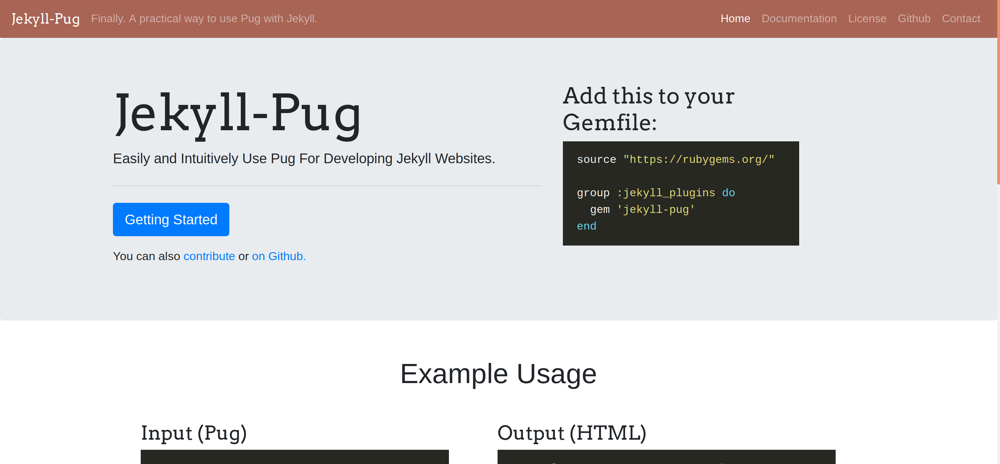
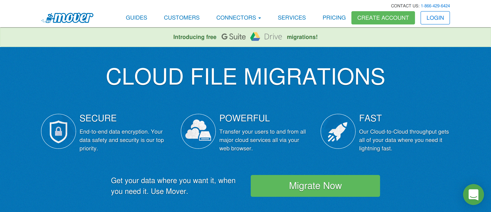

# Jekyll-Pug

Finally be able to code with [Pug](https://github.com/pugjs/pug) on [Jekyll](http://github.com/mojombo/jekyll).

Created by [Doug Beney](https://dougie.io).

If you enjoy this project, do [sign up for my email list](http://jekyll-pug.dougie.io/) to receive info on other plugins and tools I create for Jekyll.

## Table Of Contents

- [Installation](#installation)
- [Configuration](#configuration)
- [Usage](#usage)
- [Using Shipped Pug Versions](#using-shipped-pug-versions)
- [Troubleshooting](#troubleshooting)
- [HTML5 Boilerplate](#html5-boilerplate)
- [Deploying to Netlify](#deploying-to-netlify)
- [Deploying to Siteleaf](#deploying-to-siteleaf)
- [Sites Using Jekyll-Pug](#sites-using-jekyll-pug)
  + [Jekyll-Pug-Website [Free/Open-Source]](#jekyll-pug-website-freeopen-source)
  + [Material-Jekyll-Pug [Free/Open-Source]](#material-jekyll-pug-freeopen-source)
  + [Mover.io](#mover-io)
- [Contributing](#contributing)
- [Support on Beerpay](#support-on-beerpay)

## Installation

**Note:** you must have [pug](https://www.npmjs.com/package/pug) installed. To install it, simply enter the terminal command, `npm install pug -g`. If you don't already have NPM/Node installed, [here are instructions](https://www.npmjs.com/get-npm)

There are two ways to install this plugin.

**Way #1 - Bundler (Recommended)**

Since Bundler is now implemented into the Jekyll project, it is recommended to manage plugins using a Gemfile.

Create a file named `Gemfile` in the root directory of your project and input the following code:

```rb
source "https://rubygems.org/"

group :jekyll_plugins do
  gem 'jekyll-pug'
  # Add other Jekyll plugins you are using below this line.
end
```

After that, type `bundle install` in your Terminal.

You're done!

**Way #2 - Installing the gem globally**

In your terminal, type `gem install jekyll-pug`.

Then, edit your `_config.yml` and add the following.

```yaml
plugins:
    - jekyll-pug
```

You're done!

---

## Configuration

The main setting available in configuration is minification. This will tell the Pug command line tool whether or not to minify the output.

Minification is disabled by default. 

To turn it on, add this to your `_config.yml`:

```yaml
jekyll-pug:
  minify: true
```

If you are running into an issue, it could also help to enable Jekyll-Pug debugging. This will print a lot more to the console when your Jekyll project is building. **Debugging is disabled by default.**

To enable debugging, use the following in your `_config.yml`:

```yaml
jekyll-pug:
  debug: true
```

## Usage

Now you can create Pug pages, templates, and includes, just like you would with HTML files.

**Important:** Always make sure to have YAML front matter at the top of your pug pages. Layouts and includes don't need this, but plain-old pages do.

**Example:**

```pug
---
---

h1 Hello World!
```

---

**Practical Example:**

**index.pug**

```pug
---
title: Home Page
layout: default
---

p Welcome to my home page. Isn't it awesome?
```

**_layouts/default.pug**

```pug
doctype
html
    head
        title {{page.title}}
    body
        h1 {{page.title}}
        | {{content}}
```

---

### Include

Jekyll's `include` tag has been safely modified to support pug. Pug's native `include` tag will also look in the `_includes` folder.

```pug
h1 This code will include nav.pug
| 

h1 Or you could use Pug's native include tag
include nav
```

**Note**: The `|` symbol in this example code is a pipe character which tells Pug that we would like to render plain-text. Since Pug's templating engine processes our code before Jekyll, it's important to include this pipe character. [Read more  about piped text here](https://pugjs.org/language/plain-text.html#piped-text).

You can alternatively type the extension out.

```pug
h1 This code will include nav.pug
| 
```

Have an HTML file you want to include? No problem! Do this:

```pug
h1 This code will include nav.html
| 
```

Have an SVG file you want to include? No problem! Do this:

```pug
h1 This code will include logo.svg
| 
```

---

### "Can I use Pug extends?"

I'd highly recommend steering clear from using Pug extends with this plugin. Using Jekyll/Liquid templates is a lot more intuitive for this workflow.

If you REALLY want to use them, this plugin looks in the `_includes` folder for extends. Just keep in mind you'll have a hard time getting Pug extends to work with your Jekyll blog posts.

---

## Using Shipped Pug Versions

**Important note:** Advanced Pug features such as includes, may not work using a shipped pug library. In this case, it is best to use Jekyll's built-in includes. (`| `)

If you do not wish to install pug via NPM or if you are deploying to a location, [such as Siteleaf](#deploying-to-siteleaf), you can select a shipped Pug version via your `_config.yml`.

```
jekyll-pug:
  shipped_version: 2.0.0-beta10
```

The current versions available are:

```
2.0.0-beta10
2.0.0-beta11
2.0.0-beta12
2.0.0-beta1
2.0.0-beta2
2.0.0-beta3
2.0.0-beta4
2.0.0-beta5
2.0.0-beta6
2.0.0-beta7
2.0.0-beta8
2.0.0-beta9
2.0.0-rc.1
2.0.0-rc.2
2.0.0-rc.3
2.0.0-rc.4
```

## Troubleshooting

### "No such file or directory - pug"

This issue typically means that you do not have the NPM package `pug-cli` installed globally. [Here is the solution](https://github.com/DougBeney/jekyll-pug/issues/3)

**Have an issue that's not listed here?** [Submit a New Issue](https://github.com/DougBeney/jekyll-pug/issues/new)

## HTML5 Boilerplate

If you're looking for a boilerplate template to speed up your Jekyll-Pug development even more, check out [J5 - A Jekyll, Pug, Sass, and Livereload HTML5 Boilerplate](https://github.com/DougBeney/J5)

## Deploying to Netlify

Jekyll-Pug requires the pug-cli NPM package for its main functionality. 

First, create a package.json file using the command `npm init`.

Next, install pug-cli using `npm install pug-cli --save`.

When Netlify builds your site, it will now install pug-cli. 

If you're having any trouble whatsoever, do check out [Jekyll-Pug-Website's package.json](https://github.com/DougBeney/Jekyll-Pug-Website/blob/master/package.json) file as a reference.

## Deploying to Siteleaf

To deploy to Siteleaf, first make sure your `Gemfile` is properly set up. ([See Jekyll-Pug installation instructions using a Gemfile](#installation))

Next, make sure your `_config.yml` includes the following:

```
plugins:
- jekyll-pug

jekyll-pug:
  shipped_version: 2.0.0-beta10
```

You're all set! Enjoy having a full CMS with Jekyll-Pug!

**Note:** To use custom plugins, you must be a premium Siteleaf user. Currently Jekyll-Pug is not a whitelisted plugin by Siteleaf/Github. If/when that happens, users on the free plan will be able to use Jekyll-Pug. The whitelist is controlled by Github and you can view a list of [whitelisted plugins here](https://pages.github.com/versions/)

## Sites Using Jekyll-Pug

### Jekyll-Pug-Website [Free/Open-Source]



- Link: [material.jekyll-pug.dougie.io](http://material.jekyll-pug.dougie.io)
- Source: [github.com/DougBeney/Jekyll-Pug-Website](https://github.com/DougBeney/Jekyll-Pug-Website)

### Material-Jekyll-Pug [Free/Open-Source]


- Link: [material.jekyll-pug.dougie.io](http://material.jekyll-pug.dougie.io)
- Source: [github.com/DougBeney/jekyll-pug-material](https://github.com/DougBeney/jekyll-pug-material)

### Mover.io



- Link: [Mover.io](https://mover.io/)
- Source: Private

---

**Want your Jekyll-Pug website to be featured here?** [Submit it here](https://github.com/DougBeney/jekyll-pug/issues/6)

## Contributing

1. Fork it
2. Create your feature branch (`git checkout -b my-new-feature`)
3. Commit your changes (`git commit -am 'Add some feature'`)
4. Push to the branch (`git push origin my-new-feature`)
5. Create new Pull Request

**How to create a development environment for contributing to this plugin:**

1. Clone the repo
2. Run the command `bundle` in terminal.
3. CD into the `test-site/` directory.
4. Run the command `bundle` in terminal.
5. Run `jekyll serve`

**"What code do I modify?"**

The code you should modify is in the `lib/` directory.

- `lib/jekyll-pug.rb` - All this file does is require the main files of this plugin and work with the user's configuration file.
- `lib/jekyll-pug/pug-renderer.rb` This file safely modifies Jekyll's rendering code.
- `lib/jekyll-pug/include-tag.rb` This file safely modifies Jekyll's include tag, allowing for extension-less including and Pug support.

## Support on Beerpay
Hey dude! Help me out for a couple of :beers:!

[](https://beerpay.io/DougBeney/jekyll-pug)  [](https://beerpay.io/DougBeney/jekyll-pug?focus=wish)
